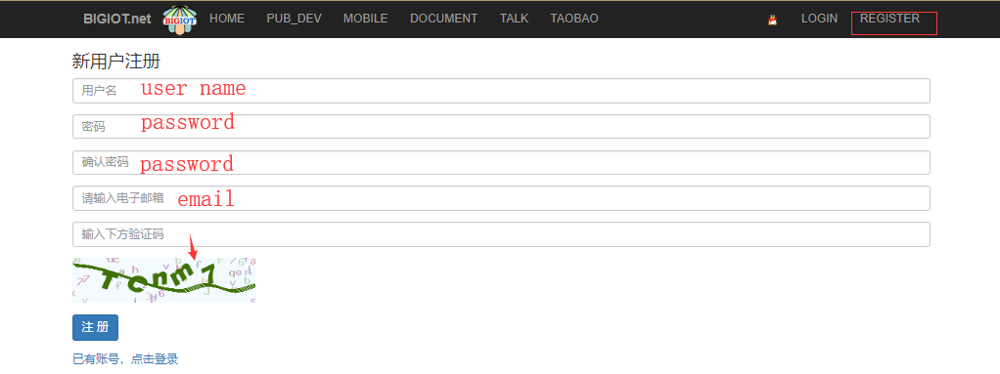
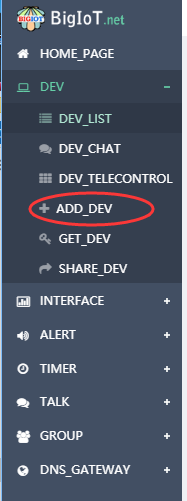
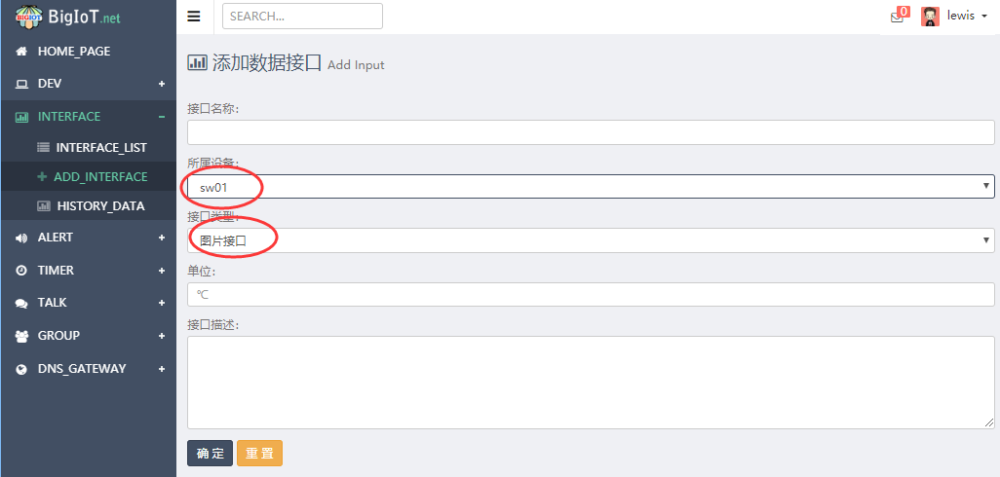
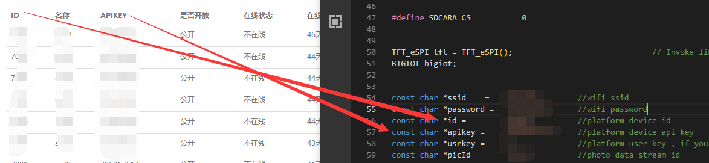
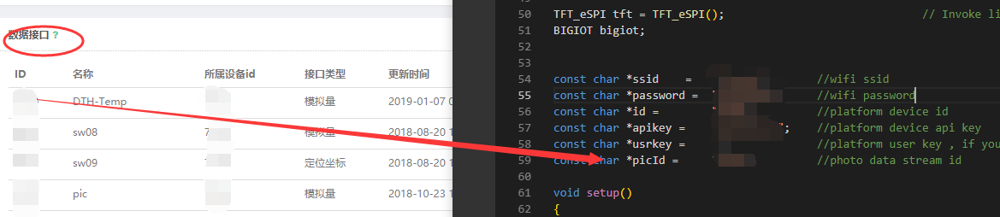
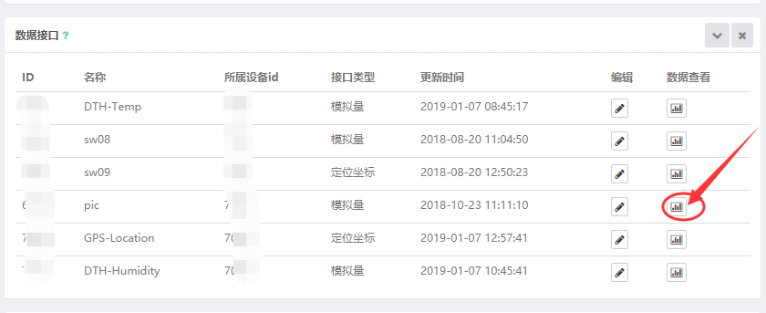
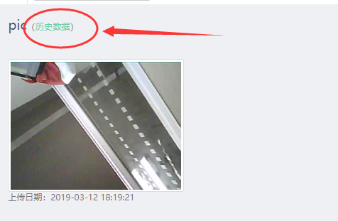
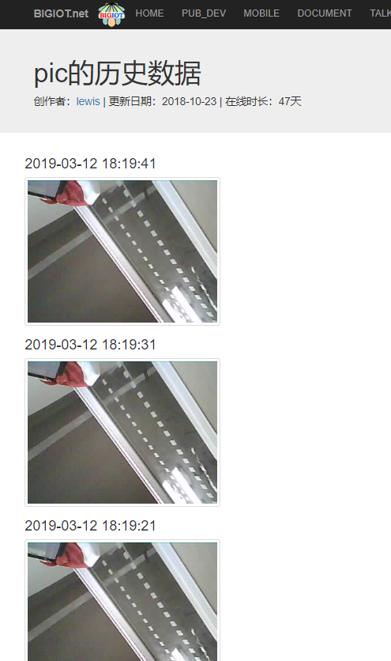

TTGO-Camera-Plus BigIOT platfrom
=====================

## 1.Install the following dependency library files:
- [TFT_eSPI](https://github.com/Bodmer/TFT_eSPI)
- [JPEGDecoder](https://github.com/Bodmer/JPEGDecoder)
- [ArduinoBIGIOT](https://github.com/lewisxhe/ArduinoBIGIOT)

## 2.TFT_eSPI settings
- Move or copy `camera_tft_def.h` to `TFT_eSPI/User_Setups/`
- Add `#include <User_Setups/camera_tft_def.h>` to  `TFT_eSPI/User_Setup_Select.h`
  
  
## 3.Description

### Use TTGO-Camera-Plus to upload captured images to the BIGIOT platform every 10 seconds

1. Registered account
    

2. Create a device

    

3. Add a data interface
    

4. Change the definition in the code to your own device data
    
    

5. View data
    

6. View historical data
    
       